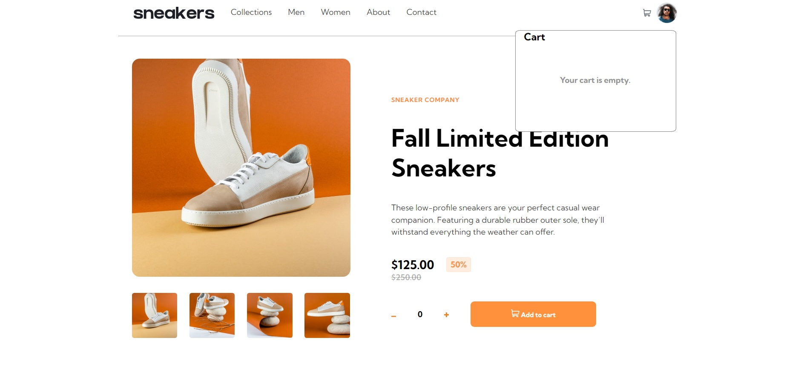
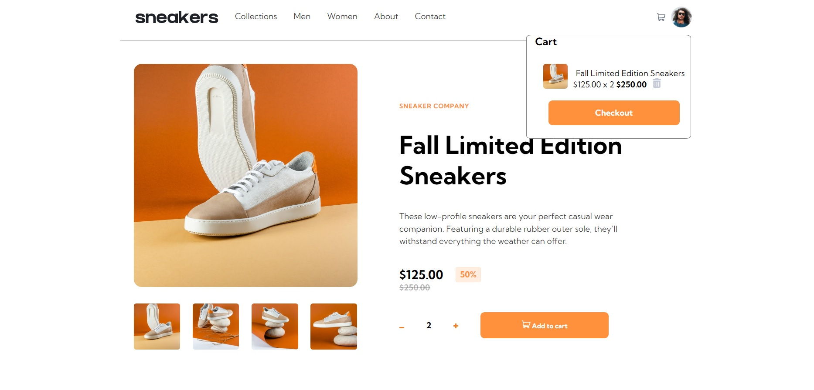
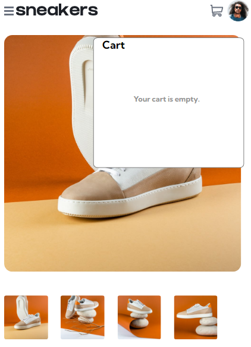
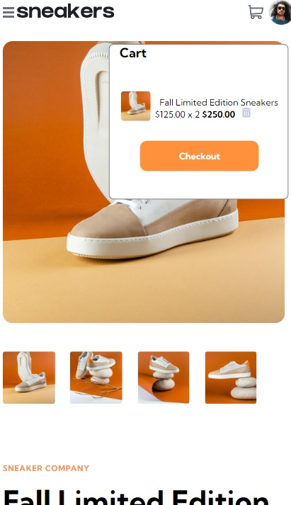
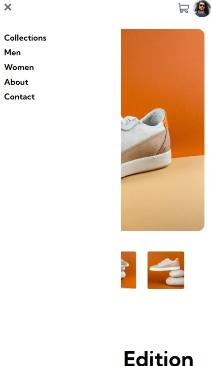

# Frontend Mentor - E-commerce product page solution

Essa é uma solução para o [E-commerce product page challenge on Frontend Mentor](https://www.frontendmentor.io/challenges/ecommerce-product-page-UPsZ9MJp6).

### O desafio

O usuário devem ser capazes de:

- Ver o layout ideal para o site, dependendo do tamanho da tela do dispositivo
- Ver os estados de foco para todos os elementos interativos na página
- Adicionar itens ao carrinho
- Visualize o carrinho e remova itens dele

### Screenshot

### Links

- Minha solução: [Add solution URL here](https://your-solution-url.com)

### Construido com

- HTML5
- Propriedades CSS
- Flexbox
- CSS Grid
- Javascript

### Oque eu aprendi

*Neste projeto desenvolvi a capacidade de criar uma pagina realmente responsiva, com um menu lateral que é ativado somente quando requisitado

*Aprendi a como utilizar Javascript para a criação de um carrinho funcional para um Ecommerce

*Aprendi como usar uma função em Javascript para fazer a alternancia de imagens em uma pagina principal.

## Autor

- Linkedin - [Gabriel Araújo](https://www.linkedin.com/in/gabriel-araújo-a5a439277/)
- Frontend Mentor - [@Araujogbs](https://www.frontendmentor.io/profile/araujogbs)
